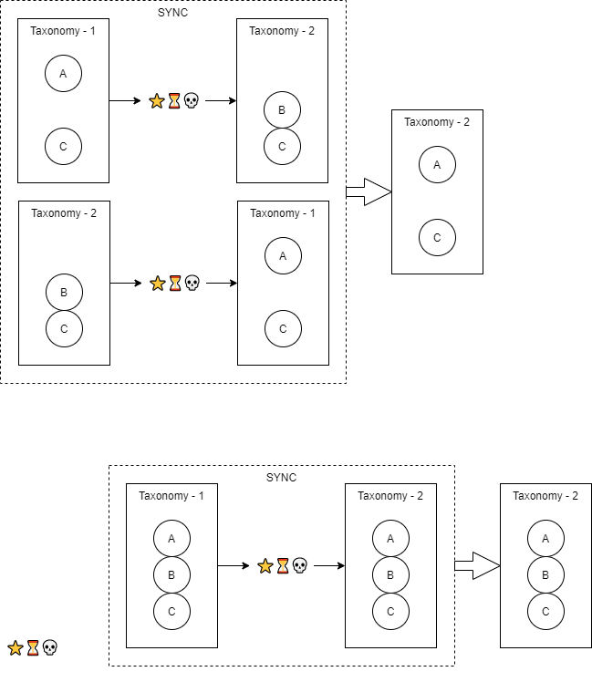

There is a class
- add all "source" categories. 

## There is some edge cases

### Ordered delete
Imagine you have 3 taxonomies A, B and C.
Your relations are:
- A & B ->💖💘💔-> C

So anytime something a term in A or B is created/updated/deleted, it also appears in C.

Now you create the term 'foo' in A and B. It will be present _once_ in C. Then you delete 'foo' in B again. 
'foo' will **not** be present in C then (which might be confusing).
When you update 'foo's description in A it will again be present.

###

## Permissions
