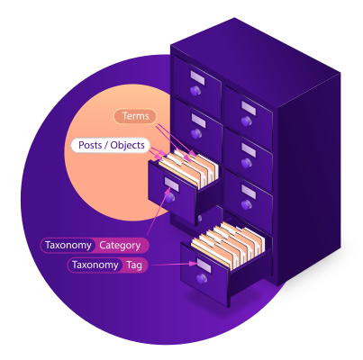

# Shared Term Taxonomies

Allows you to "share" or "synchronize" terms and term-relations between different taxonomies.  
❗ This is still a work in progress!

When you create a taxonomy with ``register_taxonomy`` you can assign ``(meta-)capabilities``. If you want to ``manage_terms`` you need to be able to ``publish_posts``.
When you create a shared relation these ``capabilites`` become ``actions`` which can be synced. The default ones are: ``manage_terms`` ( 💖 when you create a term ), ``edit_terms`` ( 💘 when you update an existing term ), ``delete_terms`` ( 💔 when you delete a term) and ``assign_terms`` (💞 when you assign an ``object_id`` like a post or user to a ``term_taxonomy_id`` ). _Sorry for the hearts, do you have better emojis?_

It does two basic things:
1. (One/two way) Sync **terms** of different taxonomies.
   1. Example one way: You have two taxonomies: `animals` and `pets`. Now you set up: `pets`->💖💘💔->`animals`. Whenever you add a pet (like "dog") it is also added to animals (we assume: "every pet is an animal").
   2. Example two way: You have users in different teams. You create taxonomies: ``User-Team`` (to assign users to teams) and ``Post-Team`` (to assign posts to teams). ``UT``|``PT``->💖💘💔->``UT``|``PT``. Whenever you create/edit/delete a team now (either in the tax ``PT`` or ``UT``), the same change also applies to the other. _(The extra mile) Write a filter: When a user in a shared taxonomy writes a post, the users's term is also assigned to the post. Only show posts, where users have the shared taxonomy and you have (nested) subgroups!_
2. (One/two way) Sync **term-relations** of different taxonomies. (‼ This is work in progress!)  
   Example: You have a big organisation where users are assigned to nested user-affiliations (which are taxonomies). You have three shared taxonomies:
	 - ``AAR`` Automatically added roles (by your identity management)
	 - ``UAR`` User-added roles (by the user herself)
	 - ``MR`` Merged roles.  
  
	You setup the relation ``AAR``|``UAR``->💖💘💔💞->``MR``  
	Let the user write to ``UAR`` and read from ``MR``. This way all affiliations are preserved (and can also be removed), when changes in ``AAR`` or ``UAR`` occur.


## Careful
- ❗ Make a backup before you use this plugin! Use at your own risk.
- We (miss-)use a field in ``wp_terms`` called ``term_group``. It is meant for creating aliases in the same taxonomy. This plugin uses the field to identify ``shared_terms`` (``wp_terms[slug]`` is the fallback).
  - ❗ You might have collisions with plugins which also use the ``term_group`` (I never saw one).
  - ❗ The plugin might break, as there [are plans](https://make.wordpress.org/core/2013/07/28/potential-roadmap-for-taxonomy-meta-and-post-relationships/) to get rid of ``wp_terms``
- When you create a relation A[1,2,3]->B[1,2,4] and delete 1 from A it is also deleted in B. 4 will still exist in B.

## Todo
- Sync term_relations for shared terms
- Add a backend interface to add relations (it's currently only a class)
- Write some tests, there is lots of edge-cases...

## Maybe
- Sharing Taxonomies across multiple blogs.
  - Think about handling terms with the same slug...


## Usage Example

```php
// These are slugs of taxonomies which have been registered with register_taxonomy
$taxonomies = array( 'post-affiliation', 'user-affiliation', 'blog-affiliation' );

$relation = new Shared_Taxonomies\Shared_Taxonomy_Relation(
	$taxonomies, // source taxonomies.
	$taxonomies, // destinatinon taxonomies.
	array( 'manage_terms', 'edit_terms', 'delete_terms', 'assign_terms' ) // synced actions.
);

$manager = new Shared_Taxonomies\Shared_Taxonomy_Manager();
$manager->add( $relation ); // add all relations to the manager.

// manually sync all relations (just one in this example).
$manager->sync_all_shared_taxonomies( false ); 

```

## Why don't you "reuse" the same term id in different taxonomies?

Great that you ask. [I tried that](readme-share-term-id.md). This could be a PR for WordPress.


## What is a ...?
Imagine a drawer cabinet.


[Original drawer desgin by upklyak / Freepik](http://www.freepik.com)

### Taxonomy
 One drawer is labeled "category". Another is "tag". Both are "taxonomies". So it is a _type_ of "category". Those can be created in PHP with register_taxonomy.

### Term
The folders you put in your files are the terms. They are created in the WordPress backend.

### Term relation
The drawers contain posts by default. But you can put in anything with an ID (users, blogs, ...).


